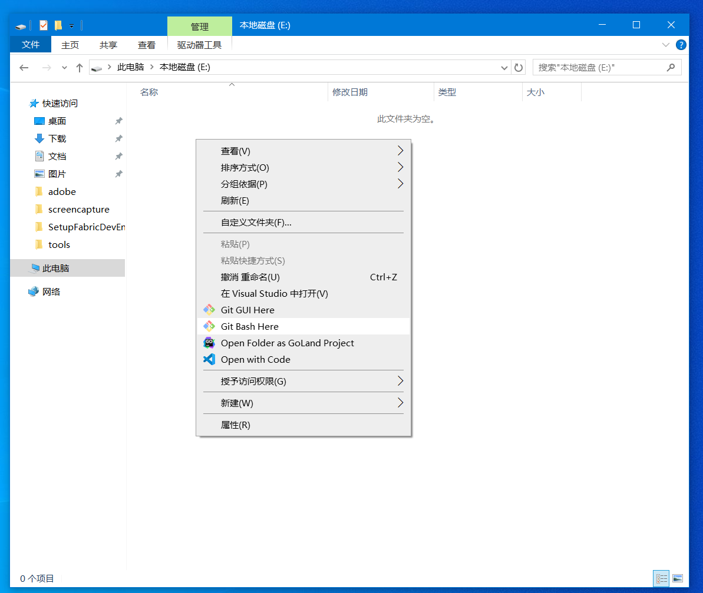
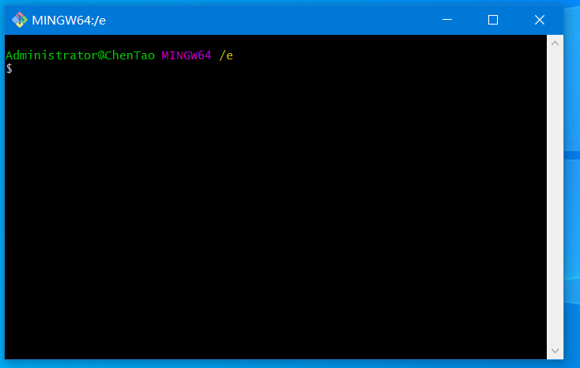

# 工具准备

我们的目的是要搭建一个可以模拟真实网络环境下的分布式环境，就需要模拟独立的主机和IP。

一个较完备的分布式 HyperledgerFabirc 网络需要如下节点

数量|节点名称|备注
--|:--:|--:
3 |  zookeeper
4 | kafka
3 | orderer
2 | peer
1 | dev | 开发节点

如果条件允许，可以直接用物理机来搭建。

如果仅做chaincode开发，只部署dev节点即可。根据自己的情况来选择。

## 1.工具列表
---

### 必备工具

1. virtualbox

    https://www.virtualbox.org/

    安装linux系统的虚拟机

2. vagrant

    https://www.vagrantup.com/

    命令行管理virtualbox虚拟机，提供独立格式的虚拟机镜像包 box，无需我们手动安装系统，直接下载已经打包好的box文件即可。

### 备选工具

1. git

    https://git-scm.com/ 

    一方面，可以做本地的代码管理

    另一方面，windows版的git安装后提供类Linux的Bash命令行工具，如下图

    

    

    对于习惯Linux命令操作的人来说比较亲和。
    也可以选择使用windows自带的 PowerShell 操作习惯接近于bash，个人喜好自由选择。

2. VisualStudioCode

    用做文本编辑