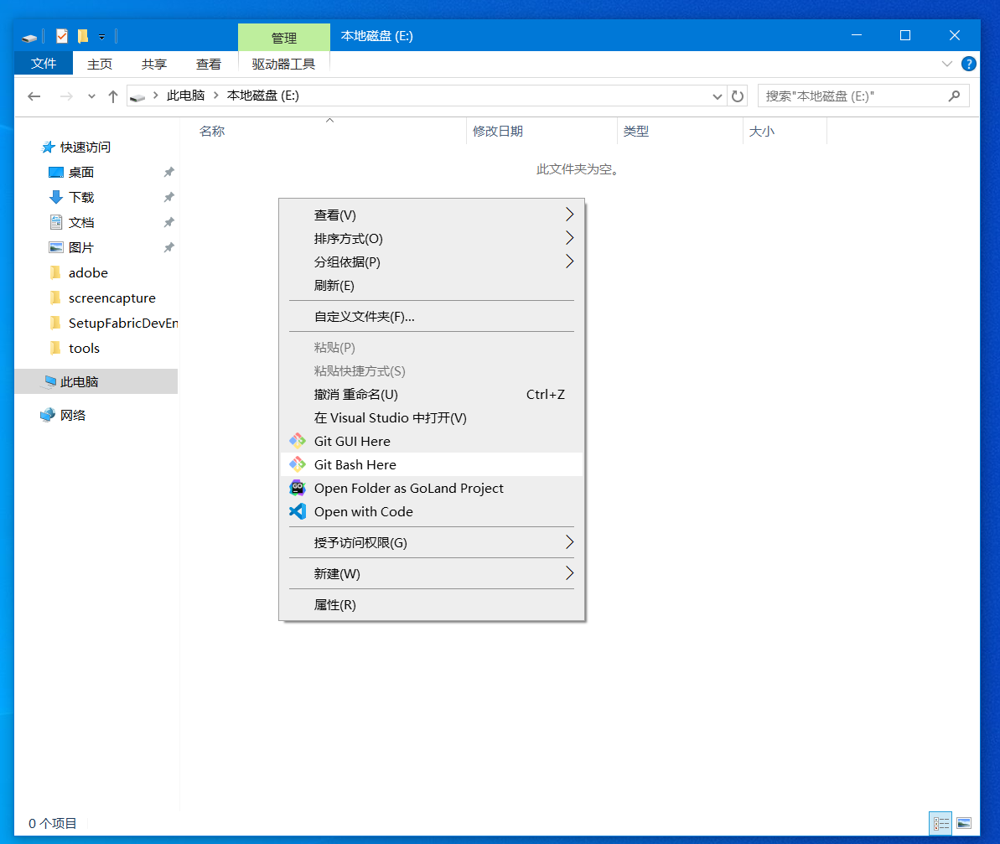
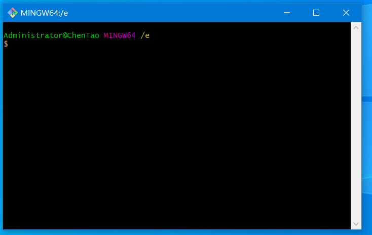
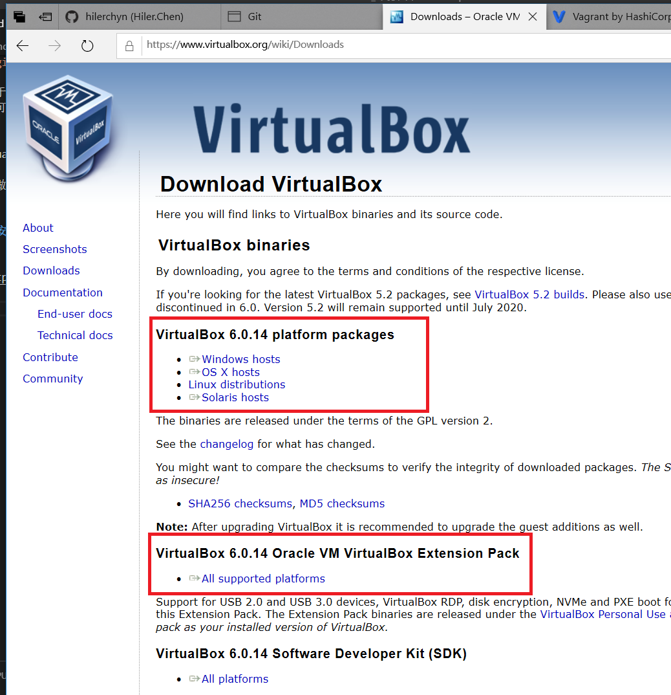
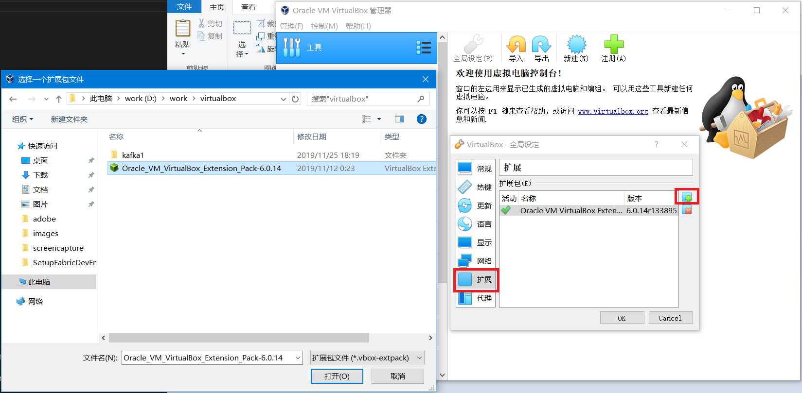
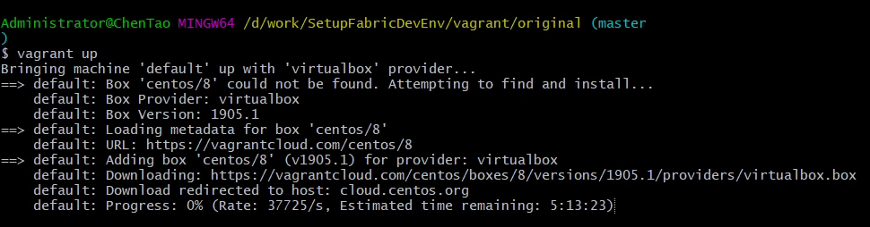

# 01 环境准备

本系列的内容是参照Hyperledger Fabric 官方文档，实际学习、操作后，编写而成的。


我们最终目的是要搭建一个可以模拟真实网络环境下的分布式环境，就需要模拟独立的主机和IP。

一个较完备的分布式 HyperledgerFabirc 网络需要如下节点：

数量|节点名称|备注
--|:--:|--:
3 |  zookeeper
4 | kafka |
3 | orderer | 排序节点
2 | peer | 对等节点
1 | dev | 开发节点

如果条件允许，可以直接用物理机来搭建。

如果仅做chaincode开发，只部署dev节点即可。根据自己的情况来选择。

---

文中的环境是用虚拟机以桥接的方式来模拟足够数量的linux主机，然后在此基础上部署Hyperledger Fabric。操作环境 Windows10， 此文中用到的工具是跨平台的，所以步骤基本适用于 Linux 和 Mac。


## 1. 工具列表
---

### 必备工具

1. VirtualBox

    https://www.virtualbox.org/

    安装linux系统的虚拟机

2. Vagrant

    https://www.vagrantup.com/

    命令行管理virtualbox虚拟机，提供独立格式的虚拟机镜像包 box，无需我们手动安装系统，直接下载已经打包好的box文件即可。


### 备选工具

1. git

    https://git-scm.com/ 

    一方面，可以做本地的代码管理

    另一方面，windows版的git安装后提供类Linux的Bash命令行工具，如下图

    

    

    对于习惯Linux命令操作的人来说比较亲和。
    也可以选择使用windows自带的 PowerShell 操作习惯接近于bash，个人喜好自由选择。


2. VisualStudioCode

    https://code.visualstudio.com/

    用做文本编辑


## 2. 安装VirtualBox
---

https://www.virtualbox.org/wiki/Downloads




需要下载 VirtualBox 安装程序和 VirtualBox Extension Pack 包， extension pack 用于与主机共享文件夹。

设置虚拟机创建后的存储位置，确保磁盘空间足够大


安装扩展，第一次安装完VirtualBox后需要重启主机才能安装扩展包。




## 3. 安装Vagrant
---


https://www.vagrantup.com/downloads.html

下载对应平台的安装程序，我们下载 Windows 64-bit 版本

安装完成后便可以在命令行中直接使用  vagrant


---


创建original 文件夹，用于导入官方 CentOS8

```

mkdir original

cd ./original

vagrant init

```

vagrant init 用于生成 Vagrantfile 配置文件


https://app.vagrantup.com/centos/boxes/8


参照官方文档导入 CentOS8的vagrant box，修改Vagrantfile 加入如下内容

```
Vagrant.configure("2") do |config|
  config.vm.box = "centos/8"
  config.vm.box_version = "1905.1"
end
```

在目录下运行 vagrant up 即可启动虚拟机，





从上图中的文字信息 "Box 'centos/8' could not be found. Attempting to find and install..."可以推测出, Vagrant先从本地找box镜像，如果本地找不到则会从官方的镜像仓库中查找并下载。由于下载速度太慢，我们手动导入box。

首先 直接从 http://cloud.centos.org/centos/8/vagrant/x86_64/images/ 下载对应virtualbox的 box 镜像。

```
 $ vagrant box add centos/8 /d/work/virtualbox/CentOS-8-Vagrant-8.0.1905-1.x86_64.vagrant-virtualbox.box
==> box: Box file was not detected as metadata. Adding it directly...
==> box: Adding box 'centos/8' (v0) for provider:
    box: Unpacking necessary files from: file:///D:/work/virtualbox/CentOS-8-Vagrant-8.0.1905-1.x86_64.vagrant-virtualbox.box
    box:
==> box: Successfully added box 'centos/8' (v0) for 'virtualbox'!
```

添加名为 centos/8 的box，box路径为 /d/work/virtualbox/CentOS-8-Vagrant-8.0.1905-1.x86_64.vagrant-virtualbox.box


```
$ vagrant box list
centos/8     (virtualbox, 0)
original     (virtualbox, 0)
originalPeer (virtualbox, 0)
workbench    (virtualbox, 0)

```

名为 centos/8 已在本地添加成功


启动vagrant

```
$ vagrant up
Bringing machine 'default' up with 'virtualbox' provider...
==> default: Importing base box 'centos/8'...
==> default: Matching MAC address for NAT networking...
==> default: Setting the name of the VM: original_default_1575959324704_23159
==> default: Clearing any previously set network interfaces...
==> default: Preparing network interfaces based on configuration...
    default: Adapter 1: nat
==> default: Forwarding ports...
    default: 22 (guest) => 2222 (host) (adapter 1)
==> default: Booting VM...
==> default: Waiting for machine to boot. This may take a few minutes...
    default: SSH address: 127.0.0.1:2222
    default: SSH username: vagrant
    default: SSH auth method: private key
    default:
    default: Vagrant insecure key detected. Vagrant will automatically replace
    default: this with a newly generated keypair for better security.
    default:
    default: Inserting generated public key within guest...
    default: Removing insecure key from the guest if it's present...
    default: Key inserted! Disconnecting and reconnecting using new SSH key...
==> default: Machine booted and ready!
[default] No Virtualbox Guest Additions installation found.

.
.
.

Copy iso file D:\Program Files\Oracle\VirtualBox\VBoxGuestAdditions.iso into the box /tmp/VBoxGuestAdditions.iso
Mounting Virtualbox Guest Additions ISO to: /mnt
mount: /mnt: WARNING: device write-protected, mounted read-only.
Installing Virtualbox Guest Additions 6.0.14 - guest version is unknown
Verifying archive integrity... All good.
Uncompressing VirtualBox 6.0.14 Guest Additions for Linux........
VirtualBox Guest Additions installer
Copying additional installer modules ...
Installing additional modules ...
VirtualBox Guest Additions: Starting.
VirtualBox Guest Additions: Building the VirtualBox Guest Additions kernel
modules.  This may take a while.
VirtualBox Guest Additions: To build modules for other installed kernels, run
VirtualBox Guest Additions:   /sbin/rcvboxadd quicksetup <version>
VirtualBox Guest Additions: or
VirtualBox Guest Additions:   /sbin/rcvboxadd quicksetup all
VirtualBox Guest Additions: Building the modules for kernel
4.18.0-80.el8.x86_64.
Redirecting to /bin/systemctl start vboxadd.service
Redirecting to /bin/systemctl start vboxadd-service.service
Unmounting Virtualbox Guest Additions ISO from: /mnt
vagrant_vbguest.machine_loop_guard
==> default: Checking for guest additions in VM...
==> default: Rsyncing folder: /cygdrive/d/work/SetupFabricDevEnv/vagrant/original/ => /vagrant

```

安装vagrant-vbguest插件，与虚拟机文件同步

```
$ vagrant plugin install vagrant-vbguest
Installing the 'vagrant-vbguest' plugin. This can take a few minutes...
Installed the plugin 'vagrant-vbguest (0.22.0)'!
```

