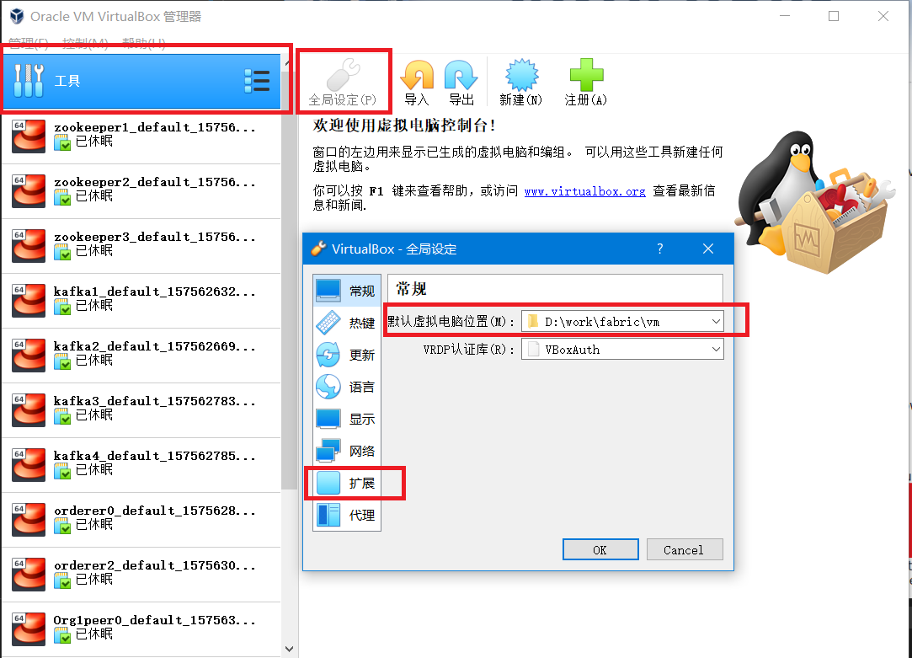

# 01 环境准备


我们的目的是要搭建一个可以模拟真实网络环境下的分布式环境，就需要模拟独立的主机和IP。

一个较完备的分布式 HyperledgerFabirc 网络需要如下节点

数量|节点名称|备注
--|:--:|--:
3 |  zookeeper
4 | kafka
3 | orderer
2 | peer
1 | dev | 开发节点

如果条件允许，可以直接用物理机来搭建。

如果仅做chaincode开发，只部署dev节点即可。根据自己的情况来选择。

---

文中的环境是用虚拟机以桥接的方式来模拟足够数量的linux主机，然后在此基础上部署Hyperledger Fabric。操作环境 Windows10， 此文中用到的工具是跨平台的，所以步骤基本适用于 Linux 和 Mac。


## 1. 工具列表
---

### 必备工具

1. VirtualBox

    https://www.virtualbox.org/

    安装linux系统的虚拟机

2. Vagrant

    https://www.vagrantup.com/

    命令行管理virtualbox虚拟机，提供独立格式的虚拟机镜像包 box，无需我们手动安装系统，直接下载已经打包好的box文件即可。


### 备选工具

1. git

    https://git-scm.com/ 

    一方面，可以做本地的代码管理

    另一方面，windows版的git安装后提供类Linux的Bash命令行工具，如下图

    

    

    对于习惯Linux命令操作的人来说比较亲和。
    也可以选择使用windows自带的 PowerShell 操作习惯接近于bash，个人喜好自由选择。


2. VisualStudioCode

    用做文本编辑


## 2. 安装VirtualBox
---

https://www.virtualbox.org/wiki/Downloads


需要下载 VirtualBox 安装程序和 VirtualBox Extension Pack 包， extension pack 用于与主机共享文件夹。

设置虚拟机创建后的存储位置，确保磁盘空间足够大




安装扩展，第一次安装完VirtualBox后需要重启主机才能安装扩展包。


## 3. 安装Vagrant
---


https://www.vagrantup.com/downloads.html

下载对应平台的安装程序，我们下载 Windows 64-bit 版本

安装完成后便可以在命令行中直接使用  vagrant


---


创建original 文件夹，用于导入官方 CentOS8

```

mkdir original

cd ./original

vagrant init

```

vagrant init 用于生成 Vagrantfile 配置文件


https://app.vagrantup.com/centos/boxes/8


参照官方文档导入 CentOS8的vagrant box，修改Vagrantfile 加入如下内容

```
Vagrant.configure("2") do |config|
  config.vm.box = "centos/8"
  config.vm.box_version = "1905.1"
end
```

在目录下运行 vagrant up 即可启动虚拟机，


从上图中的文字信息 "Box 'centos/8' could not be found. Attempting to find and install..."可以推测出, Vagrant先从本地找box镜像，如果本地找不到则会从官方的镜像仓库中查找并下载。由于下载速度太慢，我们手动导入box。

首先 直接从 http://cloud.centos.org/centos/8/vagrant/x86_64/images/ 下载对应virtualbox的 box 镜像。


