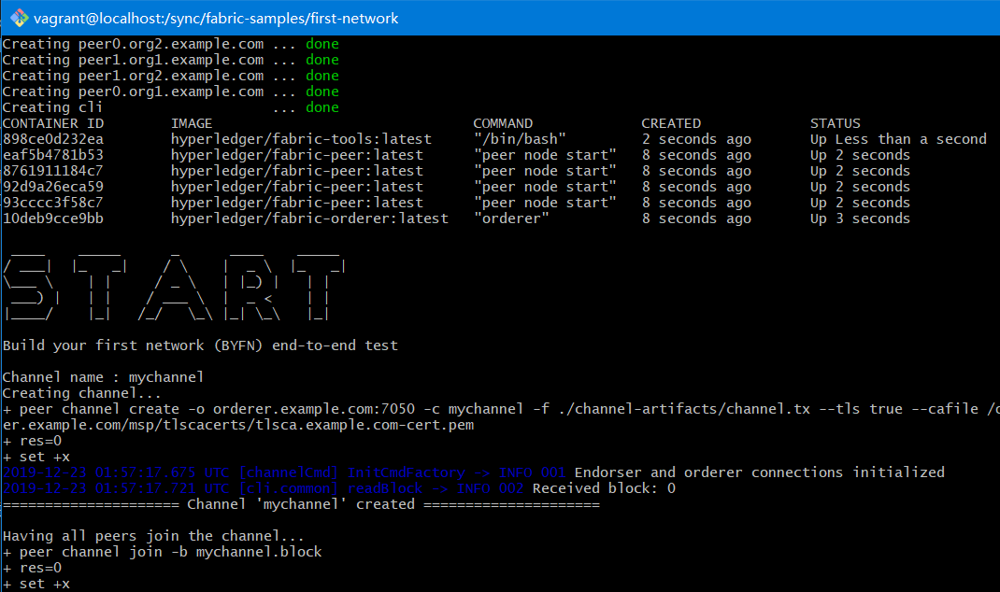
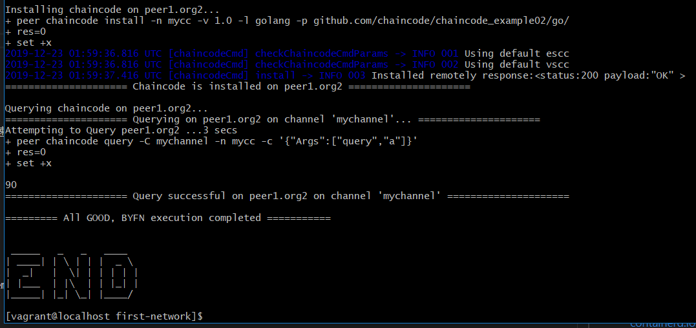
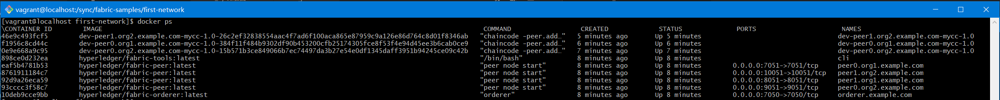
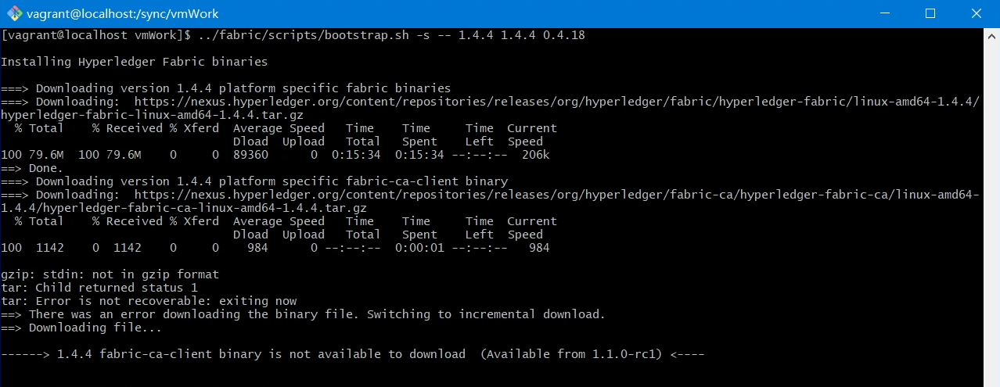

# 02 构建你的第一个Fabric网络


**本示例中的坑**
1. 安装最新版的docker时，其依赖的包containerd.io版本不匹配，需要下载官方的rpm包单独安装或降级安装。
2. 官方未提供 fabric-ca-client 的1.4.4版本，需要手动编译。
3. 下载二进制和镜像的脚本文件，需要用官方源码中的脚本。
4. 虚拟机的磁盘容量默认10G，由可能会提示磁盘空间不足，需要扩容磁盘。（视频中未演示，后续会出一期单独的扩容的文章和视频）

此教程以搭建运行官方的Build Your First Network(简称：BYFN)示例环境为主。

官方文档： https://hyperledger-fabric.readthedocs.io/en/release-1.4/build_network.html

构建你的第一个网络(BYFN) 的场景提供了由2个组织，每个组织维护2个peer对等节点的Hyperledger Fabric网络。这个网络默认部署了一个独立的排序服务，当然其他的排序服务的实现也是可以的。

4 peer 

1 orderer

1 cli

至少需要6个docker容器。


开始启动容器环境：




运行环境启动完成：




完整运行后运行的docker列表：



```
docker ps --format "{{.Image}}\t{{.Names}}"
```
IMAGE | NAME
-- | --
dev-peer1.org2.example.com-mycc-1.0-26c2ef32838554aac4f7ad6f100aca865e87959c9a126e86d764c8d01f8346ab |dev-peer1.org2.example.com-mycc-1.0
dev-peer0.org1.example.com-mycc-1.0-384f11f484b9302df90b453200cfb25174305fce8f53f4e94d45ee3b6cab0ce9    |dev-peer0.org1.example.com-mycc-1.0
dev-peer0.org2.example.com-mycc-1.0-15b571b3ce849066b7ec74497da3b27e54e0df1345daff3951b94245ce09c42b    |dev-peer0.org2.example.com-mycc-1.0
hyperledger/fabric-tools:latest | cli
hyperledger/fabric-peer:latest  | peer0.org1.example.com
hyperledger/fabric-peer:latest  | peer1.org2.example.com
hyperledger/fabric-peer:latest  | peer1.org1.example.com
hyperledger/fabric-peer:latest  | peer0.org2.example.com
hyperledger/fabric-orderer:latest  | orderer.example.com


上面列表是成功运行BYFN示例后，本地的所有启动的docker容器，需要注意的是NAME带有dev-前缀的docker容器。
这些示例是在安装chaincode时由peer对等节点创建的，用于编译、安装、实例化chaincode的容器。


## 一、环境准备
---


沿用01文章中的运行环境(安装文档及视频：https://www.toutiao.com/i6770625810551276036/#6649976-qzone-1-55490-3c8d8e8bb11b3fb9a4fd89478693d6c1)。

禁用 vbguest 的自动更新，加速vagrant启动速度

更新系统:
```
yum update
yum upgrade
```

如果系统默认的软件源很慢，可以使用国内的软件源。


## 二、安装先决条件
---

所有需要的先决条件：git、curl、docker、docker-compose、golang、nodejs、python

官方文档： https://hyperledger-fabric.readthedocs.io/en/latest/prereqs.html


### 1.安装Docker
---

安装文档：https://docs.docker.com/install/linux/docker-ce/centos/


安装需要的软件包：

```
sudo yum install -y yum-utils \
  device-mapper-persistent-data \
  lvm2
```

配置稳定版docker的软件源：

```
sudo yum-config-manager \
    --add-repo \
    https://download.docker.com/linux/centos/docker-ce.repo
```


安装docker社区版：

```
$sudo yum install docker-ce docker-ce-cli containerd.io

Last metadata expiration check: 0:53:58 ago on Wed 18 Dec 2019 01:49:26 AM UTC.
Error:
 Problem: package docker-ce-3:19.03.5-3.el7.x86_64 requires containerd.io >= 1.2.2-3, but none of the providers can be installed
  - cannot install the best candidate for the job
  - package containerd.io-1.2.10-3.2.el7.x86_64 is excluded
  - package containerd.io-1.2.2-3.3.el7.x86_64 is excluded
  - package containerd.io-1.2.2-3.el7.x86_64 is excluded
  - package containerd.io-1.2.4-3.1.el7.x86_64 is excluded
  - package containerd.io-1.2.5-3.1.el7.x86_64 is excluded
  - package containerd.io-1.2.6-3.3.el7.x86_64 is excluded
(try to add '--skip-broken' to skip uninstallable packages or '--nobest' to use not only best candidate packages)

```

最新的 docker-ce 19.03.5 要求 containerd.io 必须 >= 1.2.2，看一下当前系统的软件源中的containerd.io 版本


```
[vagrant@localhost first-network]$ yum list containerd.io --showduplicates | sort -r
Yarn Repository                                  70 kB/s | 364 kB     00:05
Node.js Packages for Enterprise Linux 8 - x86_6  18 kB/s |  92 kB     00:05
Installed Packages
containerd.io.x86_64            1.2.0-3.el7                     docker-ce-stable
containerd.io.x86_64            1.2.0-2.2.rc.2.1.el7            docker-ce-stable
containerd.io.x86_64            1.2.0-2.0.rc.0.1.el7            docker-ce-stable
containerd.io.x86_64            1.2.0-1.2.beta.2.el7            docker-ce-stable
Available Packages

```

最先版本为 1.2.0 不符合 docker-ce 19.03.5 的依赖要求。

安装符合最新版docker-ce依赖要求的containerd.io，可以通过以下3形式：

1.  软件源降级直接安装

```
sudo yum install --nobest docker-ce docker-ce-cli containerd.io
```

2. 下载 rpm 包

https://download.docker.com/linux/centos/7/x86_64/stable/Packages/

rpm 包解压后的目录结构

```
.
├── etc
│   └── containerd
│       └── config.toml
└── usr
    ├── bin
    │   ├── containerd
    │   ├── containerd-shim
    │   ├── ctr
    │   └── runc
    ├── lib
    │   └── systemd
    │       └── system
    │           └── containerd.service
    └── share
        ├── doc
        │   └── containerd.io-1.2.10
        │       └── README.md
        ├── licenses
        │   └── containerd.io-1.2.10
        │       └── LICENSE
        └── man
            ├── man1
            │   ├── containerd.1
            │   ├── containerd-config.1
            │   └── ctr.1
            └── man5
                └── containerd-config.toml.5

15 directories, 12 files
```

```
 sudo yum install -y ./containerd.io-1.2.10-3.2.el7.x86_64.rpm
```


3. 手动编译


编译containerd
<hr/>

```
# v1.2.10

./bin
├── containerd
├── containerd-shim
├── containerd-shim-runc-v1
#├── containerd-shim-runc-v2 // v1.3.0 中生成的
├── containerd-stress
└── ctr
```

~~与rpm包执行程序不匹配，需要手动调整，将 containerd-shim-runc-v1 改为 runc 或者 做软连接~~

编译 runc
<hr/>

生成的二进制执行文件中没有runc，而runc 需要从 https://github.com/opencontainers/runc 编译， 对应的源码版本：

```
runc version 1.0.0-rc8+dev
commit: 3e425f80a8c931f88e6d94a8c831b9d5aa481657
spec: 1.0.1-dev
```

手动创建 systemd 和 配置文件
<hr/>


containerd.io安装完后，重新执行下面的命令来安装docker-ce

```
 sudo yum install docker-ce docker-ce-cli
```


重新安装docker-ce
---

```
$sudo yum install docker-ce docker-ce-cli
```


需要启用docker服务，并将当前的用户添加到docker用户组中。

```
#启用docker服务
sudo systemctl enable docker

#将当前用户添加到docker用户组中
sudo usermod -a -G docker vagrant

#启动docker
sudo systemctl start docker
```

### 2.安装docker-compose
---

https://docs.docker.com/compose/install/


```
sudo curl -L "https://github.com/docker/compose/releases/download/1.25.0/docker-compose-$(uname -s)-$(uname -m)" -o /usr/local/bin/docker-compose

sudo chmod +x /usr/local/bin/docker-compose

```


### 3.安装 node.js
---

https://github.com/nodesource/distributions/blob/master/README.md


```
curl -sL https://rpm.nodesource.com/setup_10.x | bash -

## Run `sudo yum install -y nodejs` to install Node.js 10.x and npm.
## You may also need development tools to build native addons:
     sudo yum install gcc-c++ make
## To install the Yarn package manager, run:
     curl -sL https://dl.yarnpkg.com/rpm/yarn.repo | sudo tee /etc/yum.repos.d/yarn.repo
     sudo yum install yarn

```

python 默认没有安装，后续需要时再安装


## 三、安装示例、二进制文件和Docker镜像
---


https://hyperledger-fabric.readthedocs.io/en/release-1.4/install.html


### 1.下载Fabric源码仓库

下载Fabric源码仓库，是因为我们要用到仓库中下载二进制文件和docker镜像的脚本。


```
git clone https://github.com/hyperledger/fabric.git
```

切换到到最新的版本分支v1.4.4下

```
git checkout v1.4.4
```

我们要用到

```
./scripts/
├── bin
│   └── orderer
├── bootstrap.sh
├── changelog.sh
├── check_deps.sh
├── check_license.sh
├── check_spelling.sh
├── check_trailingspaces.sh
├── compile_protos.sh
├── generateHelpDocs.sh
├── golinter.sh
├── goListFiles.sh
├── metrics_doc.sh
├── multiarch.sh
├── pull_build_artifacts.sh
└── run-integration-tests.sh

```

scripts目录下的bootstrap.sh 脚本，来下载二进制文件和镜像。


### 2.下载二进制文件和docker镜像

官方文档中用如下命令来操作，

```
curl -sSL http://bit.ly/2ysbOFE | bash -s -- 1.4.4 1.4.4 0.4.18
```

但是由于防火墙的原因，国内是无法下载到的，所以我们用如下命令下载：

```
/path/to/fabric/scripts/bootstrap.sh -s -- 1.4.4 1.4.4 0.4.18
```

执行完成会在当前目录下生成bin和config两个文件夹：

```
./bin/
├── configtxgen
├── configtxlator
├── cryptogen
├── discover
├── fabric-ca-client
├── idemixgen
├── orderer
└── peer
./config
├── configtx.yaml
├── core.yaml
└── orderer.yaml

```

但是在实际的下载过程中因为官方fabric-ca二级制没有提供v1.4.4的编译版本，会提示下载错误如下图：




我们需要手动编译 fabric-ca-client 的 v1.4.4 版本。
(如何安装编译需要的golang包，请参看视频教程)

```
git clone https://github.com/hyperledger/fabric-ca.git

cd fabric-ca

git checkout v1.4.4

git checkout -b v1.4.4

make
```

输出如下内容：

```
[vagrant@localhost fabric-ca]$ make
/home/vagrant/go/src/github.com/hyperledger/fabric-ca already exists
Copying build/docker/bin/fabric-ca-client build/docker/bin/fabric-ca-server build/fabric-ca.tar.bz2 to build/image/fabric-ca/payload
mkdir -p build/image/fabric-ca/payload
cp build/docker/bin/fabric-ca-client build/docker/bin/fabric-ca-server build/fabric-ca.tar.bz2 build/image/fabric-ca/payload
Building fabric-ca-server in bin directory ...
Built bin/fabric-ca-server
Building fabric-ca-client in bin directory ...
Built bin/fabric-ca-client
Running unit tests ...
ok      github.com/hyperledger/fabric-ca/cmd/fabric-ca-client/command   104.490s        coverage: 89.4% of statements
ok      github.com/hyperledger/fabric-ca/cmd/fabric-ca-server   8.662s  coverage: 92.3% of statements
ok      github.com/hyperledger/fabric-ca/lib    261.326s        coverage: 85.4% of statements
ok      github.com/hyperledger/fabric-ca/lib/attr       0.049s  coverage: 98.1% of statements
ok      github.com/hyperledger/fabric-ca/lib/attrmgr    0.005s  coverage: 87.9% of statements
ok      github.com/hyperledger/fabric-ca/lib/caerrors   0.005s  coverage: 86.8% of statements
ok      github.com/hyperledger/fabric-ca/lib/client/credential/idemix   0.130s  coverage: 94.5% of statements
ok      github.com/hyperledger/fabric-ca/lib/client/credential/x509     0.086s  coverage: 95.3% of statements
ok      github.com/hyperledger/fabric-ca/lib/common/log 0.009s  coverage: 90.5% of statements
ok      github.com/hyperledger/fabric-ca/lib/metadata   0.005s  coverage: 90.0% of statements
ok      github.com/hyperledger/fabric-ca/lib/server/certificaterequest  0.053s  coverage: 96.3% of statements
ok      github.com/hyperledger/fabric-ca/lib/server/db  0.011s  coverage: 91.7% of statements
ok      github.com/hyperledger/fabric-ca/lib/server/db/factory  0.049s  coverage: 100.0% of statements
ok      github.com/hyperledger/fabric-ca/lib/server/db/mysql    0.058s  coverage: 89.6% of statements
ok      github.com/hyperledger/fabric-ca/lib/server/db/postgres 0.067s  coverage: 90.8% of statements
ok      github.com/hyperledger/fabric-ca/lib/server/db/sqlite   0.067s  coverage: 91.6% of statements
ok      github.com/hyperledger/fabric-ca/lib/server/db/util     0.007s  coverage: 90.5% of statements
ok      github.com/hyperledger/fabric-ca/lib/server/idemix      2.673s  coverage: 92.1% of statements
ok      github.com/hyperledger/fabric-ca/lib/server/operations  38.503s coverage: 88.8% of statements
ok      github.com/hyperledger/fabric-ca/lib/server/user        6.361s  coverage: 85.7% of statements
ok      github.com/hyperledger/fabric-ca/lib/spi        0.003s  coverage: 100.0% of statements
ok      github.com/hyperledger/fabric-ca/lib/streamer   0.006s  coverage: 86.4% of statements
ok      github.com/hyperledger/fabric-ca/lib/tls        0.897s  coverage: 87.9% of statements
ok      github.com/hyperledger/fabric-ca/util   6.464s  coverage: 87.7% of statements
Finished running all tests
[vagrant@localhost fabric-ca]$ tree ./bin
./bin
├── fabric-ca-client
└── fabric-ca-server

0 directories, 2 files
[vagrant@localhost fabric-ca]$ ./bin/fabric-ca-client version
fabric-ca-client:
 Version: 1.4.4
 Go version: go1.12.14
 OS/Arch: linux/amd64
[vagrant@localhost fabric-ca]$

```

会在 fabric-ca 源码目录下生成 bin 文件中存放我们编译后的 fabric-ca-client 文件，将此文件拷贝至 上一步操作中下载的bin目录下

### 3.下载示例仓库

https://github.com/hyperledger/fabric-samples.git

```
git clone https://github.com/hyperledger/fabric-samples.git

cd fabric-samples

```

将上一步操作中下载的 bin 和 config 目录 拷贝到 当前目录下。

然后进入 first-network 目录：


```
[vagrant@localhost fabric-samples]$ tree -L 1 ./first-network/
./first-network/
├── base
├── byfn.sh
├── ccp-generate.sh
├── ccp-template.json
├── ccp-template.yaml
├── channel-artifacts
├── configtx.yaml
├── connection-org1.json
├── connection-org1.yaml
├── connection-org2.json
├── connection-org2.yaml
├── connection-org3.json
├── connection-org3.yaml
├── crypto-config
├── crypto-config.yaml
├── docker-compose-ca.yaml
├── docker-compose-cli.yaml
├── docker-compose-couch-org3.yaml
├── docker-compose-couch.yaml
├── docker-compose-e2e-template.yaml
├── docker-compose-e2e.yaml
├── docker-compose-etcdraft2.yaml
├── docker-compose-kafka.yaml
├── docker-compose-org3.yaml
├── eyfn.sh
├── org3-artifacts
├── README.md
└── scripts

5 directories, 23 files
```

生成证书、创世区块和频道配置信息：

```
./byfn.sh generate
```

启动 Hyperledger Fabric 网络

```
./byfn.sh up
```

如果配置没有问题的话，至此我们的单机环境就搭建完成了。如需要深入学习，请参照官方文档 https://hyperledger-fabric.readthedocs.io/en/release-1.4/build_network.html。
