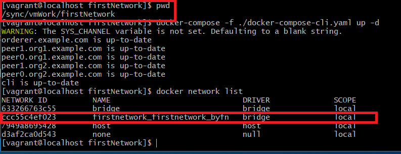
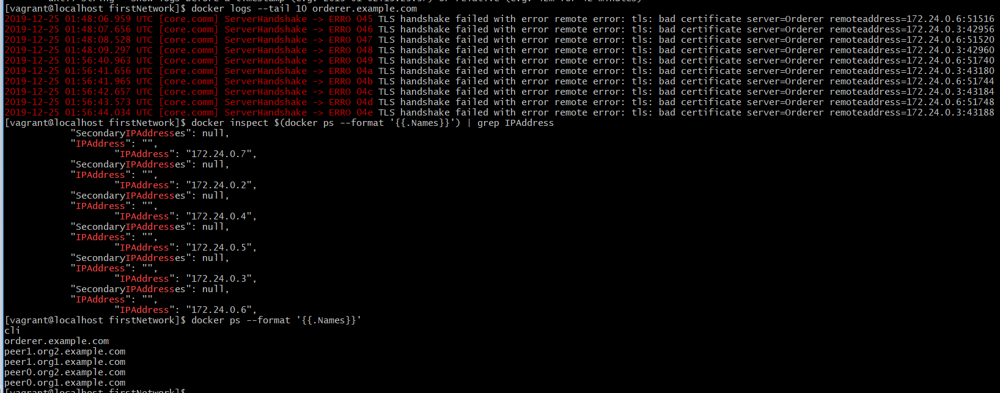
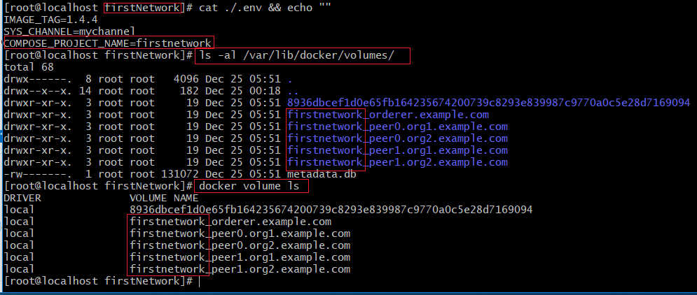

# 03 从头搭建BYFN环境


## Docker Network的设定

https://docs.docker.com/compose/networking/


```
version: '2'

volumes:
  orderer.example.com:
  peer0.org1.example.com:
  peer1.org1.example.com:
  peer0.org2.example.com:
  peer1.org2.example.com:

networks:
  byfn:

services:

  orderer.example.com:
    extends:
      file:   base/docker-compose-base.yaml
      service: orderer.example.com
    container_name: orderer.example.com
    networks:
      - byfn

```

如上 docker-compose.yaml 文件中的定义，

networks:
    byfn:

定义一个 byfn的网络连接，

但你启动时 

Your app’s network is given a name based on the “project name”, which is based on the name of the directory it lives in. You can override the project name with either the --project-name flag or the COMPOSE_PROJECT_NAME environment variable.

docker-compose 会在这个名字前加一个前缀用来标识项目名称，这个前缀名是以你当前执行命令的目录名为准，你也可以使用 --project-name 标记 或 COMPOSE_PROJECT_NAME 这个环境变量来重载这个名字。





上图是我们实际操作后查看到的结果

如果我们没有在 docker-compose.yaml 配置文件中指定 networks:  的话， docker-compose 会以当前目录名为前缀创建一个_default 网络，即：


```
firstnetwork_default
```


在启动的过程后 排序节点出现如下错误：




```
volumes:
  orderer.example.com:
  peer0.org1.example.com:
  peer1.org1.example.com:
  peer0.org2.example.com:
  peer1.org2.example.com:
```

是因为上面的配置，在之前测试运行过程中生成了相同的volumes，且旧数据也保存在这些volume中，旧的ca数据与新生成的数据不一致，所以导致了上图中出现了错误。

在本地测试时，出现上图中的错误，还有一个可能的远因，就是ca证书中没有对应本地的domain即没有包含localhost或127.0.0.1这个域，
所以我在crypto-config.yaml中对每个Hostname都追加了 SANS 配置。


### volume的知识点
---


https://docs.docker.com/compose/compose-file/compose-file-v2/#volumes


https://docs.docker.com/engine/reference/commandline/volume_create/





docker-compose 创建的volumes也加了项目名称作为前缀。


