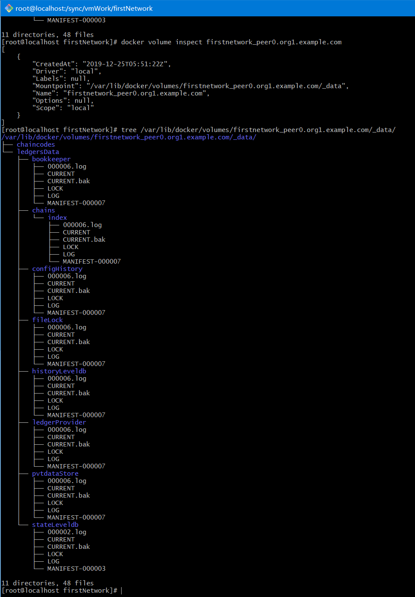
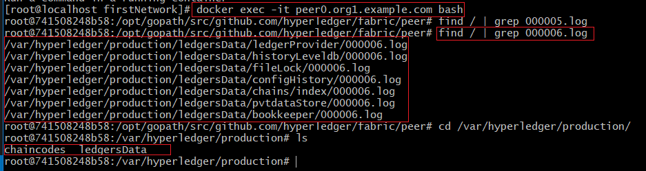
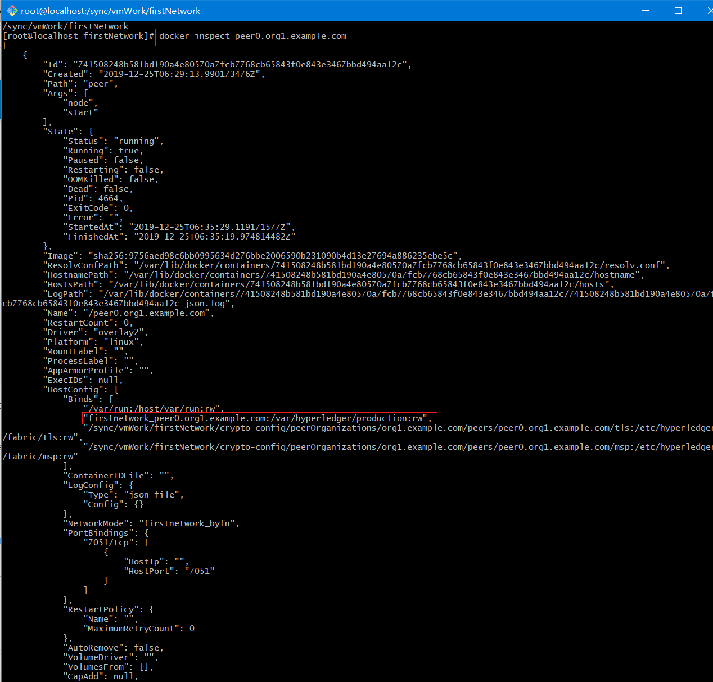
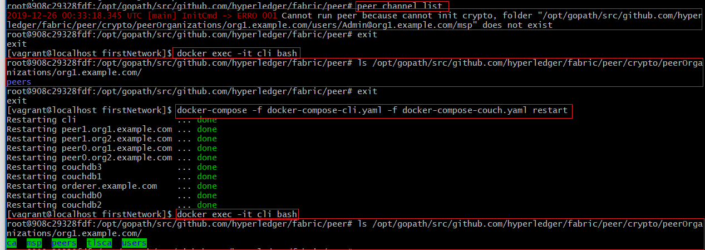
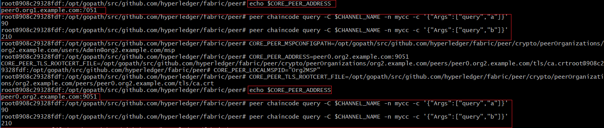
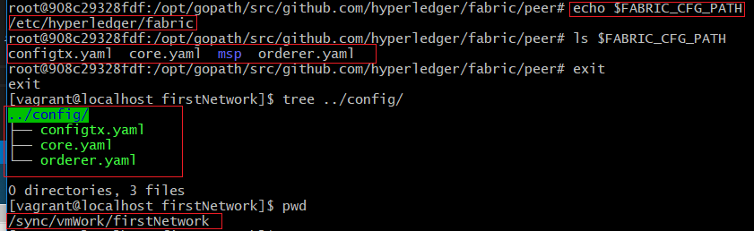
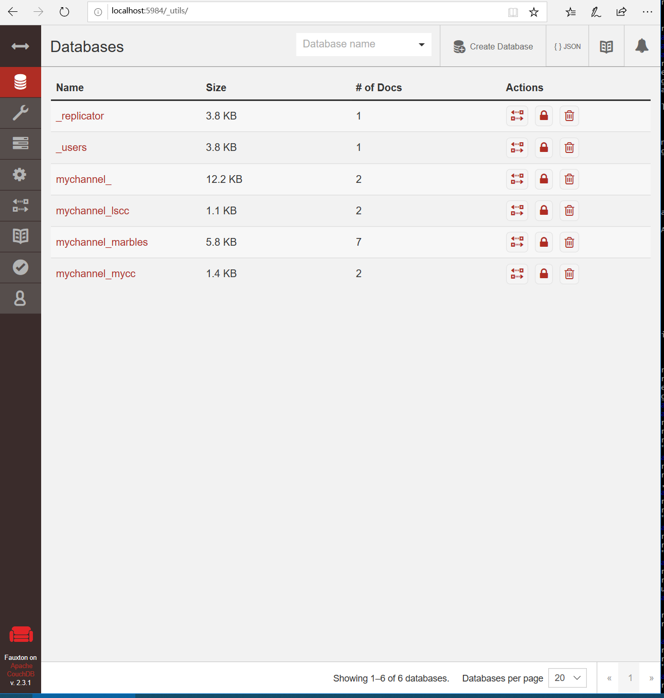
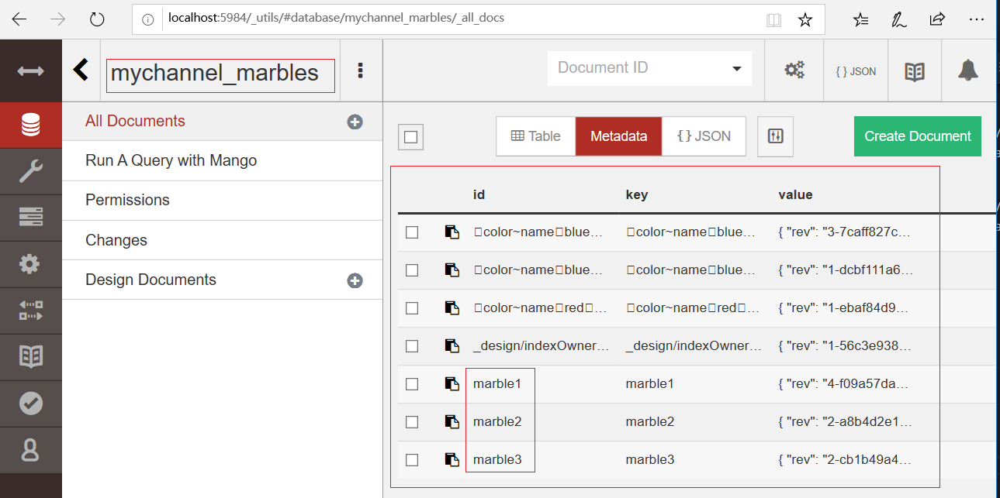
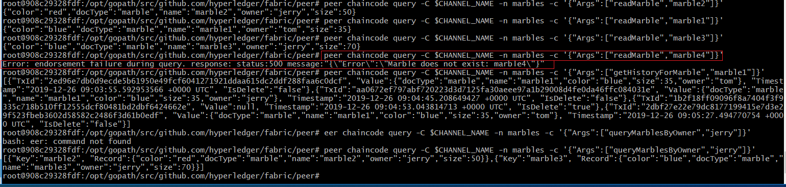

# 03 从头搭建BYFN环境


## Docker Network的设定

https://docs.docker.com/compose/networking/


```
version: '2'

volumes:
  orderer.example.com:
  peer0.org1.example.com:
  peer1.org1.example.com:
  peer0.org2.example.com:
  peer1.org2.example.com:

networks:
  byfn:

services:

  orderer.example.com:
    extends:
      file:   base/docker-compose-base.yaml
      service: orderer.example.com
    container_name: orderer.example.com
    networks:
      - byfn

```

如上 docker-compose.yaml 文件中的定义，

networks:
    byfn:

定义一个 byfn的网络连接，

但你启动时 

Your app’s network is given a name based on the “project name”, which is based on the name of the directory it lives in. You can override the project name with either the --project-name flag or the COMPOSE_PROJECT_NAME environment variable.

docker-compose 会在这个名字前加一个前缀用来标识项目名称，这个前缀名是以你当前执行命令的目录名为准，你也可以使用 --project-name 标记 或 COMPOSE_PROJECT_NAME 这个环境变量来重载这个名字。


上图是我们实际操作后查看到的结果

如果我们没有在 docker-compose.yaml 配置文件中指定 networks:  的话， docker-compose 会以当前目录名为前缀创建一个_default 网络，即：


```
firstnetwork_default
```


在启动的过程后 排序节点出现如下错误：


```
volumes:
  orderer.example.com:
  peer0.org1.example.com:
  peer1.org1.example.com:
  peer0.org2.example.com:
  peer1.org2.example.com:
```

是因为上面的配置，在之前测试运行过程中生成了相同的volumes，且旧数据也保存在这些volume中，旧的ca数据与新生成的数据不一致，所以导致了上图中出现了错误。

在本地测试时，出现上图中的错误，还有一个可能的远因，就是ca证书中没有对应本地的domain即没有包含localhost或127.0.0.1这个域，
所以我在crypto-config.yaml中对每个Hostname都追加了 SANS 配置。


### volume的知识点
---


https://docs.docker.com/compose/compose-file/compose-file-v2/#volumes


https://docs.docker.com/engine/reference/commandline/volume_create/


docker-compose 创建的volumes也加了项目名称作为前缀。


我们查看一下生成的volume的信息：



如上图中查看到的信息，其实所有的docker容器中的数据全部通过volume导出到当前宿主机中了。
这就是为什么我们之前测试删除后的容器的数据，在新的容器中仍然存在。

我们进入容器中查看一下 volume 挂载到了 容器的什么位置上：



通过上面的两张图中的数据，可以找到对应关系，即：

宿主机的volume：
 /var/lib/docker/volumes/firstnetwork_peer0.org1.example.com/_data/

对应，容器中的：
 /var/hyperledger/production/


通过 docker inspect 命令查看，容器的volume绑定信息，如下，可以佐证我们的推测




volumes的所有映射全部配置在 base\docker-compose-base.yaml 文件中。


### 设置Docker容器开机自启
---

docker-composer.yaml 中配置如下内容：

restart: always

如果没有配置，则可以用下面的命令更新启动设置：

 docker update --restart=always $( docker ps --format '{{.Names}}')


*重启后出现MSP证书文件夹没有同步的问题*



如上图，重启系统进入cli中查看channel列表是提示错误：

```
2019-12-26 00:33:18.345 UTC [main] InitCmd -> ERRO 001 Cannot run peer because cannot init crypto, folder "/opt/gopath/src/github.com/hyperledger/fabric/peer/crypto/peerOrganizations/org1.example.com/users/Admin@org1.example.com/msp" does not exist
```

msp证书文件不存在，重启所有容器后再次查看已经同步完成。

Docker随机启动的过程中可能存在volume同步的问题。


## 创建并加入频道
---

```
# Environment variables for PEER0

CORE_PEER_MSPCONFIGPATH=/opt/gopath/src/github.com/hyperledger/fabric/peer/crypto/peerOrganizations/org1.example.com/users/Admin@org1.example.com/msp
CORE_PEER_ADDRESS=peer0.org1.example.com:7051
CORE_PEER_LOCALMSPID="Org1MSP"
CORE_PEER_TLS_ROOTCERT_FILE=/opt/gopath/src/github.com/hyperledger/fabric/peer/crypto/peerOrganizations/org1.example.com/peers/peer0.org1.example.com/tls/ca.crt
```


 Channel names must be all lower case, less than 250 characters long and match the regular expression [a-z][a-z0-9.-]*.


```
export CHANNEL_NAME=mychannel

# the channel.tx file is mounted in the channel-artifacts directory within your CLI container
# as a result, we pass the full path for the file
# we also pass the path for the orderer ca-cert in order to verify the TLS handshake
# be sure to export or replace the $CHANNEL_NAME variable appropriately

peer channel create -o orderer.example.com:7050 -c $CHANNEL_NAME -f ./channel-artifacts/channel.tx --tls --cafile /opt/gopath/src/github.com/hyperledger/fabric/peer/crypto/ordererOrganizations/example.com/orderers/orderer.example.com/msp/tlscacerts/tlsca.example.com-cert.pem
```


Notice the --cafile that we pass as part of this command. It is the local path to the orderer’s root cert, allowing us to verify the TLS handshake.


加入channel

```
# By default, this joins ``peer0.org1.example.com`` only
# the <CHANNEL_NAME.block> was returned by the previous command
# if you have not modified the channel name, you will join with mychannel.block
# if you have created a different channel name, then pass in the appropriately named block

 peer channel join -b mychannel.block
```


切换到org2的peer0，并将org2 peer0 加入到channel

```
CORE_PEER_MSPCONFIGPATH=/opt/gopath/src/github.com/hyperledger/fabric/peer/crypto/peerOrganizations/org2.example.com/users/Admin@org2.example.com/msp 
CORE_PEER_ADDRESS=peer0.org2.example.com:9051
CORE_PEER_LOCALMSPID="Org2MSP" 
CORE_PEER_TLS_ROOTCERT_FILE=/opt/gopath/src/github.com/hyperledger/fabric/peer/crypto/peerOrganizations/org2.example.com/peers/peer0.org2.example.com/tls/ca.crt
peer channel join -b mychannel.block
```


**注意CORE_PEER_MSPCONFIGPATH变量**
---

org1 和 org2 的peer0节点在加入的时候指定的 CORE_PEER_MSPCONFIGPATH 变量，用到的users都是用的Admin的证书信息：

```
org1.example.com/users/Admin@org1.example.com/msp
org2.example.com/users/Admin@org2.example.com/msp
```

用Admin证书操作的节点，是否指定该节点为Admin节点？


## 更新对等节点的锚点 (Update the anchor peers)
---


下面的命令用作 channel 更新，并且会扩展到channel的定义中。本质上讲，我们会在channel的创世区块上增加附加配置信息。需要注意的是，我们不是修改创世区块，而只是简单的将增量信息加入到即将定义的对等节点的锚点上。

更新channel的定义，来定义Org1的对等节点的锚点：


```
peer channel update -o orderer.example.com:7050 -c $CHANNEL_NAME -f ./channel-artifacts/Org1MSPanchors.tx --tls --cafile /opt/gopath/src/github.com/hyperledger/fabric/peer/crypto/ordererOrganizations/example.com/orderers/orderer.example.com/msp/tlscacerts/tlsca.example.com-cert.pem
```


```
CORE_PEER_MSPCONFIGPATH=/opt/gopath/src/github.com/hyperledger/fabric/peer/crypto/peerOrganizations/org2.example.com/users/Admin@org2.example.com/msp CORE_PEER_ADDRESS=peer0.org2.example.com:9051 CORE_PEER_LOCALMSPID="Org2MSP" CORE_PEER_TLS_ROOTCERT_FILE=/opt/gopath/src/github.com/hyperledger/fabric/peer/crypto/peerOrganizations/org2.example.com/peers/peer0.org2.example.com/tls/ca.crt peer channel update -o orderer.example.com:7050 -c $CHANNEL_NAME -f ./channel-artifacts/Org2MSPanchors.tx --tls --cafile /opt/gopath/src/github.com/hyperledger/fabric/peer/crypto/ordererOrganizations/example.com/orderers/orderer.example.com/msp/tlscacerts/tlsca.example.com-cert.pem
```

## Install & Instantiate Chaincode
---

peer0.org1 安装chaincode

```
CORE_PEER_MSPCONFIGPATH=/opt/gopath/src/github.com/hyperledger/fabric/peer/crypto/peerOrganizations/org1.example.com/users/Admin@org1.example.com/msp
CORE_PEER_ADDRESS=peer0.org1.example.com:7051
CORE_PEER_LOCALMSPID="Org1MSP"
CORE_PEER_TLS_ROOTCERT_FILE=/opt/gopath/src/github.com/hyperledger/fabric/peer/crypto/peerOrganizations/org1.example.com/peers/peer0.org1.example.com/tls/ca.crt

# this installs the Go chaincode. For go chaincode -p takes the relative path from $GOPATH/src
peer chaincode install -n mycc -v 1.0 -p github.com/chaincode/chaincode_example02/go/
```


peer0.org2 安装chaincode

```

CORE_PEER_MSPCONFIGPATH=/opt/gopath/src/github.com/hyperledger/fabric/peer/crypto/peerOrganizations/org2.example.com/users/Admin@org2.example.com/msp
CORE_PEER_ADDRESS=peer0.org2.example.com:9051
CORE_PEER_LOCALMSPID="Org2MSP"
CORE_PEER_TLS_ROOTCERT_FILE=/opt/gopath/src/github.com/hyperledger/fabric/peer/crypto/peerOrganizations/org2.example.com/peers/peer0.org2.example.com/tls/ca.crt

# this installs the Go chaincode. For go chaincode -p takes the relative path from $GOPATH/src
peer chaincode install -n mycc -v 1.0 -p github.com/chaincode/chaincode_example02/go/
```


peer0.org2 上实例化chaincode_example02

```
# be sure to replace the $CHANNEL_NAME environment variable if you have not exported it
# if you did not install your chaincode with a name of mycc, then modify that argument as well

peer chaincode instantiate -o orderer.example.com:7050 --tls --cafile /opt/gopath/src/github.com/hyperledger/fabric/peer/crypto/ordererOrganizations/example.com/orderers/orderer.example.com/msp/tlscacerts/tlsca.example.com-cert.pem -C $CHANNEL_NAME -n mycc -v 1.0 -c '{"Args":["init","a", "100", "b","200"]}' -P "AND ('Org1MSP.peer','Org2MSP.peer')"
```

Next, instantiate the chaincode on the channel. This will initialize the chaincode on the channel, set the endorsement policy for the chaincode, and launch a chaincode container for the targeted peer. Take note of the -P argument. This is our policy where we specify the required level of endorsement for a transaction against this chaincode to be validated.
In the command below you’ll notice that we specify our policy as -P "AND ('Org1MSP.peer','Org2MSP.peer')". This means that we need “endorsement” from a peer belonging to Org1 AND Org2 (i.e. two endorsement). If we changed the syntax to OR then we would need only one endorsement.


### 查询

```
 query -C $CHANNEL_NAME -n mycc -c '{"Args":["query","a"]}'
```

### invoke 调用

```
peer chaincode invoke -o orderer.example.com:7050 --tls true --cafile /opt/gopath/src/github.com/hyperledger/fabric/peer/crypto/ordererOrganizations/example.com/orderers/orderer.example.com/msp/tlscacerts/tlsca.example.com-cert.pem -C $CHANNEL_NAME -n mycc --peerAddresses peer0.org1.example.com:7051 --tlsRootCertFiles /opt/gopath/src/github.com/hyperledger/fabric/peer/crypto/peerOrganizations/org1.example.com/peers/peer0.org1.example.com/tls/ca.crt --peerAddresses peer0.org2.example.com:9051 --tlsRootCertFiles /opt/gopath/src/github.com/hyperledger/fabric/peer/crypto/peerOrganizations/org2.example.com/peers/peer0.org2.example.com/tls/ca.crt -c '{"Args":["invoke","a","b","10"]}'
```

a 送给 b 10

查询验证：



如上图，我们用org1和org2两个对等节点上查询到的a和b的值都是相同的。


### 在第3个节点上安装chaincode
---


现在我们在第3个对等节点  Org2 的 peer1 上安装chaincode。修改下面的4个环境变量，声明Org2上peer1节点的安装命令：

```
# Environment variables for PEER1 in Org2

CORE_PEER_MSPCONFIGPATH=/opt/gopath/src/github.com/hyperledger/fabric/peer/crypto/peerOrganizations/org2.example.com/users/Admin@org2.example.com/msp
CORE_PEER_ADDRESS=peer1.org2.example.com:10051
CORE_PEER_LOCALMSPID="Org2MSP"
CORE_PEER_TLS_ROOTCERT_FILE=/opt/gopath/src/github.com/hyperledger/fabric/peer/crypto/peerOrganizations/org2.example.com/peers/peer1.org2.example.com/tls/ca.crt
```

```
peer channel join -b mychannel.block
peer chaincode install -n mycc -v 1.0 -p github.com/chaincode/chaincode_example02/go/

root@908c29328fdf:/opt/gopath/src/github.com/hyperledger/fabric/peer# peer chaincode list -C mychannel --instantiated
Get instantiated chaincodes on channel mychannel:
Name: mycc, Version: 1.0, Path: github.com/chaincode/chaincode_example02/go/, Escc: escc, Vscc: vscc

```


## Using CouchDB
---

启动CouchDB

```
 docker-compose -f ./docker-compose-cli.yaml -f ./docker-compose-couch.yaml up -d
```


```
CORE_PEER_MSPCONFIGPATH=/opt/gopath/src/github.com/hyperledger/fabric/peer/crypto/peerOrganizations/org1.example.com/users/Admin@org1.example.com/msp
CORE_PEER_ADDRESS=peer0.org1.example.com:7051
CORE_PEER_LOCALMSPID="Org1MSP"
CORE_PEER_TLS_ROOTCERT_FILE=/opt/gopath/src/github.com/hyperledger/fabric/peer/crypto/peerOrganizations/org1.example.com/peers/peer0.org1.example.com/tls/ca.crt
```

设置操作节点为 org1 的 peer0 节点：


```
[vagrant@localhost firstNetwork]$ peer chaincode install -n marbles -v 1.0 -p github.com/chaincode/marbles02/go
2019-12-26 08:28:34.734 UTC [main] InitCmd -> ERRO 001 Fatal error when initializing core config : Could not find config file. Please make sure that FABRIC_CFG_PATH is set to a path which contains core.yaml
# 将用bootstrap.sh脚本下载的 config 文件夹中的 core.yaml 文件拷贝到 firstNetwork 文件夹下。重新运行:
[vagrant@localhost firstNetwork]$ peer chaincode install -n marbles -v 1.0 -p github.com/chaincode/marbles02/go
2019-12-26 08:33:52.932 UTC [main] InitCmd -> ERRO 001 Cannot run peer because cannot init crypto, folder "/sync/vmWork/firstNetwork/msp" does not exist

```


上面的操作，是错误的操作。因为上面的操作是退出 cli 容器后，在宿主机的 /sync/vmWork/firstNetwork/ 目录下操作的，所以导致出现了上面的错误。

但是上面的错误给了我一个提示，就是 用bootstrap.sh脚本下载的 config 文件夹 是映射到了容器的什么目录下：

```
root@908c29328fdf:/opt/gopath/src/github.com/hyperledger/fabric/peer# echo $FABRIC_CFG_PATH
/etc/hyperledger/fabric
root@908c29328fdf:/opt/gopath/src/github.com/hyperledger/fabric/peer# ls $FABRIC_CFG_PATH
configtx.yaml  core.yaml  msp  orderer.yaml
```

环境变量 FABRIC_CFG_PATH 值为 /etc/hyperledger/fabric , 目录下的内容与config 目录内容一致：




```
export CHANNEL_NAME=mychannel

peer chaincode install -n marbles -v 1.0 -p github.com/chaincode/marbles02/go

peer chaincode instantiate -o orderer.example.com:7050 --tls --cafile /opt/gopath/src/github.com/hyperledger/fabric/peer/crypto/ordererOrganizations/example.com/orderers/orderer.example.com/msp/tlscacerts/tlsca.example.com-cert.pem -C $CHANNEL_NAME -n marbles -v 1.0 -c '{"Args":["init"]}' -P "OR ('Org1MSP.peer','Org2MSP.peer')"


# be sure to modify the $CHANNEL_NAME variable accordingly

peer chaincode invoke -o orderer.example.com:7050 --tls --cafile /opt/gopath/src/github.com/hyperledger/fabric/peer/crypto/ordererOrganizations/example.com/orderers/orderer.example.com/msp/tlscacerts/tlsca.example.com-cert.pem -C $CHANNEL_NAME -n marbles -c '{"Args":["initMarble","marble1","blue","35","tom"]}'
peer chaincode invoke -o orderer.example.com:7050 --tls --cafile /opt/gopath/src/github.com/hyperledger/fabric/peer/crypto/ordererOrganizations/example.com/orderers/orderer.example.com/msp/tlscacerts/tlsca.example.com-cert.pem -C $CHANNEL_NAME -n marbles -c '{"Args":["initMarble","marble2","red","50","tom"]}'
peer chaincode invoke -o orderer.example.com:7050 --tls --cafile /opt/gopath/src/github.com/hyperledger/fabric/peer/crypto/ordererOrganizations/example.com/orderers/orderer.example.com/msp/tlscacerts/tlsca.example.com-cert.pem -C $CHANNEL_NAME -n marbles -c '{"Args":["initMarble","marble3","blue","70","tom"]}'
peer chaincode invoke -o orderer.example.com:7050 --tls --cafile /opt/gopath/src/github.com/hyperledger/fabric/peer/crypto/ordererOrganizations/example.com/orderers/orderer.example.com/msp/tlscacerts/tlsca.example.com-cert.pem -C $CHANNEL_NAME -n marbles -c '{"Args":["transferMarble","marble2","jerry"]}'
peer chaincode invoke -o orderer.example.com:7050 --tls --cafile /opt/gopath/src/github.com/hyperledger/fabric/peer/crypto/ordererOrganizations/example.com/orderers/orderer.example.com/msp/tlscacerts/tlsca.example.com-cert.pem -C $CHANNEL_NAME -n marbles -c '{"Args":["transferMarblesBasedOnColor","blue","jerry"]}'
peer chaincode invoke -o orderer.example.com:7050 --tls --cafile /opt/gopath/src/github.com/hyperledger/fabric/peer/crypto/ordererOrganizations/example.com/orderers/orderer.example.com/msp/tlscacerts/tlsca.example.com-cert.pem -C $CHANNEL_NAME -n marbles -c '{"Args":["delete","marble1"]}'


```

通过网址 http://localhost:5984/_utils 查看 peer0.org1 的couchdb：




如上图 mychannel_marbles 便是 mychannel 频道上对应的链码 marbles 的数据库。




点击进入mychannel_marbles便可以看到我们刚才操作的数据已经插入。



通过上图的查询命令我们同样能够查询到。


## 为什么用 CouchDB
---

CouchDB是一种NoSQL解决方案。它是一个面向文档的数据库，其中文档字段存储为键-值映射。字段可以是一个简单的键值对、列表或映射。除了兼容被LevelDB支持的 键/复合键/键范围 查询方式外，CouchDB 还支持全数据的富查询能力，例如针对整个区块链数据的非键查询，因为它的数据内容是以JSON格式存储且完全可查询的。因此CouchDB可以满足链码、审计、报告的不被LevelDB支持的用例要求。

CouchDB还可以增强区块链的规范性和数据保护的安全性。 因为它能够通过过滤和屏蔽事务中的各个属性来实现字段级安全性，并且在需要时仅授予只读权限。


另外，CouchDB属于CAP定理的AP类型（可用性和分区容差）数据库。 它使用具有最终一致性的主-主复制模型。 可以在CouchDB文档的“最终一致性”(http://docs.couchdb.org/en/latest/intro/consistency.html
)页面上找到更多信息。 但是，在每个fabric的对等节点下，是没有数据库副本的，写入数据库是一致性和持久性的保证（非最终一致性）。


CouchDB is the first external pluggable state database for Fabric, and there could and should be other external database options. For example, IBM enables the relational database for its blockchain. And the CP-type (Consistency and Partition Tolerance) databases may also in need, so as to enable data consistency without application level guarantee.

CouchDB是第一个用于Fabric的外部插件化的状态数据库，并且可能也应该有其他外部数据库可选择。 例如，IBM为其区块链启用了关系数据库。 并且可能还需要CP类型（一致性和分区容差）数据库，以便在不保证应用程序级别的情况下实现数据一致性。


## 数据持久化的注意点
---

If data persistence is desired on the peer container or the CouchDB container, one option is to mount a directory in the docker-host into a relevant directory in the container. For example, you may add the following two lines in the peer container specification in the docker-compose-base.yaml file:

如果希望对等节点容器或CouchDB容器上的数据持久化，一种选择是将docker-host中的目录挂载到容器中的相关目录中。 例如，您可以在docker-compose-base.yaml文件的对等节点容器的配置中添加以下两行：

```
volumes:
 - /var/hyperledger/peer0:/var/hyperledger/production
```

对于CouchDB容器，你可以在CouchDB容器的配置中添加以下两行

```
volumes:
 - /var/hyperledger/couchdb0:/opt/couchdb/data
```