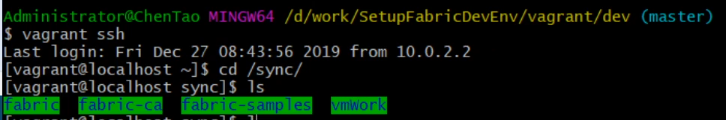

# 搭建开发环境


## 一、准备虚拟机环境
---

### 1. 导出、导入 虚拟机镜像
---

以第2期教程的虚拟机为基础，从其中导出vagrant的box镜像。


    ```
    vagrant package --output package.box
    ```


新建一个dev目录用作开发环境的虚拟机。 并将original虚拟机导出的 package.box 移动到dev目录下。


执行命令将导出的box镜像命名为dev并导入：

```
vagrant box add dev ./package.box
```


### 2. 启动dev虚拟机
---

```
vagrant init 
```

生成Vagrantfile, 如下图：


编辑Vagrantfile，设置box名称为dev。

创建虚拟机/sync目录与宿主机 ./sync 目录共享。

配置虚拟机内存为4G，4个CPU，根据自己机器的情况来设定。


```
vagrant up
```

启动虚拟机。


```
vagrant ssh
```

进入虚拟机，做如下操作：

```
# 停止所有运行中的容器
docker stop $(docker ps -aq)

# 删除所有容器
docker rm $(docker ps -aq)

# 删除所有卷
docker volume prune

# 删除所有network
docker network prune

```

操作完毕后，建议 vagrant reload 重启虚拟机。


## 二、启动开发环境
---


### 1. 安装 fabric-samples 、二进制文件和docker 镜像
---


官方文档： https://hyperledger-fabric.readthedocs.io/en/latest/install.html


**下载源码**

进入共享目录 sync 下载相关源码：

```
# fabric 源码
git clone https://github.com/hyperledger/fabric.git

# fabric-ca 源码
git clone https://github.com/hyperledger/fabric-ca.git

# fabric-samples 源码
git clone https://github.com/hyperledger/fabric-samples.git
```

并将源码切换到 v1.4.4


vagrant ssh  进入虚拟机，并切换到  /sync 目录下，创建 vmWork 目录作为虚拟机的工作目录：




**下载二进制和docker镜像**


进入 /sync/vmWork 目录，运行：

```
../fabric/scripts/bootstrap.sh -s -- 1.4.4 1.4.4 0.4.18
```

即开始了 二进制 和 docker 镜像的下载过程。


如上图所示，*fabric-ca-client* 下载仍然失败。


而且用脚本下载的bin文件夹中也没有 fabric-ca-client  文件。

我们将编译好的二进制文件拷贝到 bin 目录下即可。


**启动开发环境**

进入 fabric-samples 的源码目录中，并将 vmWork 目录下，上一步操作下载得到的 bin 和 config 文件夹拷贝到当前目录下，如下图：


进入  /sync/fabric-samples/chaincode-docker-devmode  目录下，执行

```
docker-compose -f ./docker-compose-simple.yaml up -d
```

启动开发环境对应的容器。


至此，我们的开发环境的容器已经成功运行。


## 三、测试开发环境
---

需要注意，默认channel为 myc。


进入chaincode 容器，编译并运行sacc链码：

```
docker exec -it chaincode bash
cd sacc
go build
CORE_CHAINCODE_ID_NAME=mycc:0 CORE_PEER_TLS_ENABLED=false ./sacc -peer.address peer:7052
```

进入 cli 容器，安装、实例化、调用、查询链码：

```
docker exec -it cli bash
peer chaincode install -p chaincodedev/chaincode/sacc -n mycc -v 0
peer chaincode instantiate -n mycc -v 0 -c '{"Args":["a","10"]}' -C myc
peer chaincode invoke -n mycc -c '{"Args":["set", "a", "20"]}' -C myc
peer chaincode query -n mycc -c '{"Args":["query","a"]}' -C myc
```


**修改测试**

修改容器，挂载当前目录下的chaincode 文件夹，即：

/sync/fabric-samples/chaincode-docker-devmode/chaincode


将sacc示例目录拷贝到该目录下，

```
cp -R /sync/fabric-samples/chaincode/sacc /sync/fabric-samples/chaincode-docker-devmode/chaincode/
```

修改 /sync/fabric-samples/chaincode-docker-devmode/chaincode/sacc/sacc.go 文件中的 
get() 函数的返回值，增减 "7SHU_TEST:" 前缀


安装、实例化新的chaincode 后，查询结果如下图：


结果与我们修改的一致。

